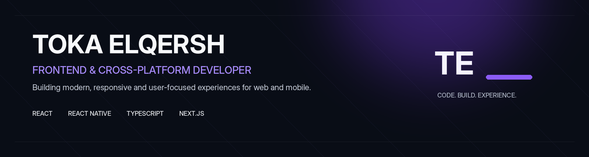

  

  <a href="https://www.linkedin.com/in/toka-elqersh"><b>LinkedIn</b></a>
  &nbsp;&nbsp;&nbsp;·&nbsp;&nbsp;&nbsp;
  <a href="mailto:tokaosamaelqersh@gmail.com"><b>Email</b></a>
  &nbsp;&nbsp;&nbsp;·&nbsp;&nbsp;&nbsp;
  <a href="https://github.com/toka09"><b>GitHub</b></a>

 

## About

I'm **Toka Elqersh**, a Frontend & Cross-Platform Developer building polished, responsive, and maintainable experiences across **web and mobile**.

I work mainly with **React, React Native, TypeScript, JavaScript, APIs, and modern frontend tooling**, with a strong focus on reusable architecture and interface quality.

**ITI Cross-Platform Development Graduate — 2026** &nbsp;·&nbsp; **Route Front-End Development Graduate**

 

---

## Selected Work

  
  

  <a href="https://embera-seven.vercel.app/"><b>Embera — View Live ↗</b></a>
  &nbsp;&nbsp;&nbsp;&nbsp;&nbsp;&nbsp;&nbsp;&nbsp;
  <a href="https://www.dst.com.sa/"><b>DST — View Live ↗</b></a>

 

  <a href="https://verdora-pi.vercel.app/home"><b>Verdora — View Live ↗</b></a>

 

---

## Technology

  

  React · React Native · Next.js · TypeScript · Redux Toolkit · React Router · TanStack Query · Axios
   
  Tailwind CSS · Bootstrap · Sass · Material UI · Firebase · Node.js · Express · REST APIs
   
  Git · GitHub · VS Code · Vite · Postman · Figma · Vercel

 

---

## Education

**2026 — Information Technology Institute (ITI)**  
Cross-Platform Development Track — **Graduate**

React · React Native · APIs · Application Architecture · Git · Team Collaboration

 

**Route Academy**  
Front-End Development Diploma

HTML · CSS · JavaScript · Bootstrap · React · Responsive Design · REST APIs · Git

 

---

## Let's Connect

Open to **Frontend, Cross-Platform, and Product Development opportunities**.

[LinkedIn](https://www.linkedin.com/in/toka-elqersh)
&nbsp;&nbsp;·&nbsp;&nbsp;
[Email](mailto:tokaosamaelqersh@gmail.com)

