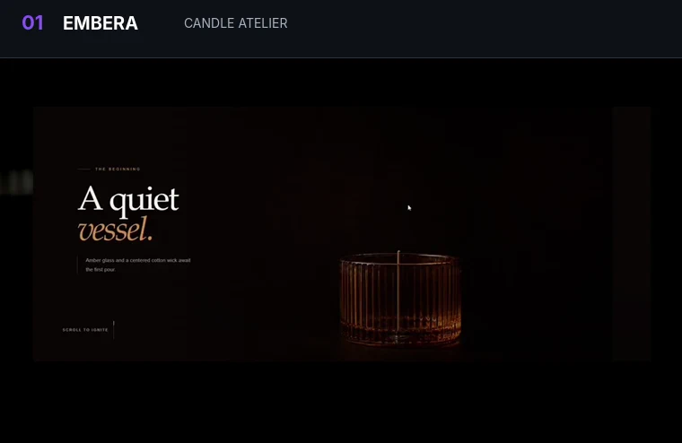
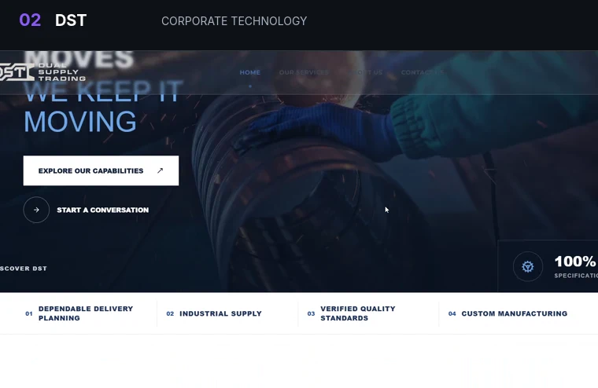
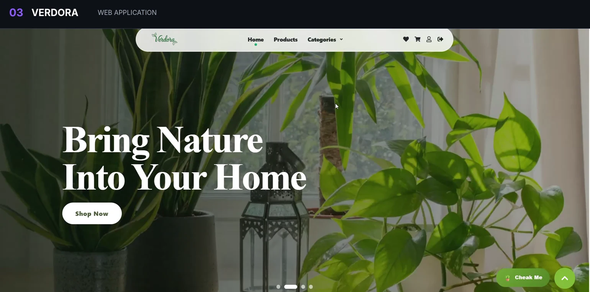

<!-- ===================== HERO ===================== -->

  

  

  Building polished, responsive products across <b>web and mobile</b>.

  <a href="https://www.linkedin.com/in/toka-elqersh"><b>LinkedIn</b></a>
  &nbsp;&nbsp;·&nbsp;&nbsp;
  <a href="mailto:tokaosamaelqersh@gmail.com"><b>Email</b></a>
  &nbsp;&nbsp;·&nbsp;&nbsp;
  <a href="https://github.com/toka09"><b>GitHub</b></a>

 

---

<!-- ===================== ABOUT ===================== -->

## About

  I build <b>clean, responsive, and maintainable products</b> across web and mobile,
  turning ideas and interfaces into polished digital experiences.

  React · React Native · TypeScript · API Integration · UI Architecture

 

<table align="center" width="88%">
<tr>
<td>

<b>developer.profile.ts</b>

<pre><code>const toka = {
  role: "Frontend & Cross-Platform Developer",
  location: "Egypt",

  stack: {
    web: ["React", "Next.js", "TypeScript"],
    mobile: ["React Native", "Expo"]
  },

  focus: [
    "Responsive UI",
    "Reusable Architecture",
    "API Integration"
  ],

  education: "ITI Graduate · 2026",
  status: "Open to opportunities"
};</code></pre>

</td>
</tr>
</table>

 

  ITI Cross-Platform Development Graduate · Route Front-End Development Graduate

 

---

<!-- ===================== PROJECTS ===================== -->

## Selected Work

  
  

  
    <b>EMBERA</b> · Candle Atelier
    &nbsp;&nbsp;&nbsp;&nbsp;&nbsp;&nbsp;&nbsp;&nbsp;
    <b>DST</b> · Corporate Technology
  

 

  <b>VERDORA</b> · Modern Web Application

  Click any preview to open the live project ↗

 

---

<!-- ===================== TECHNOLOGY ===================== -->

## Technology

<table align="center" width="82%">
<tr>

<td width="50%" valign="top">

### Frontend

  

React · Next.js · TypeScript · JavaScript 
Redux Toolkit · React Router · TanStack Query · Axios

</td>

<td width="50%" valign="top">

### Mobile & Integration

  

React Native · Expo · Firebase · Firestore 
Node.js · Express · Authentication · REST APIs

</td>

</tr>

<tr>

<td width="50%" valign="top">

### UI

  

Tailwind CSS · Bootstrap · Sass 
Material UI · Ant Design · Figma

</td>

<td width="50%" valign="top">

### Workflow

  

Git · GitHub · VS Code · Vite 
npm · Postman · Vercel

</td>

</tr>
</table>

 

---

<!-- ===================== EDUCATION ===================== -->

## Education

<table>
<tr>

<td width="50%" valign="top">

### ITI
**Information Technology Institute**

Cross-Platform Development Track  
**Graduate · 2026**

React · React Native · APIs · Application Architecture · Git · Team Collaboration

</td>

<td width="50%" valign="top">

### Route Academy

**Front-End Development Diploma**

HTML · CSS · JavaScript · Bootstrap · React · Responsive Design · REST APIs · Git

</td>

</tr>
</table>

 

---

<!-- ===================== FOOTER ===================== -->

## Let's Connect

Open to **Frontend, Cross-Platform, and Product Development opportunities**.

 

<a href="https://www.linkedin.com/in/toka-elqersh"><b>LinkedIn</b></a>
&nbsp;&nbsp;·&nbsp;&nbsp;
<a href="mailto:tokaosamaelqersh@gmail.com"><b>Email Me</b></a>

  

  

