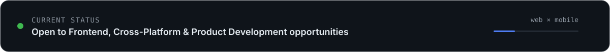

<!-- ===================== HERO ===================== -->

<p align="center">
  
</p>


---

<!-- ===================== ABOUT ===================== -->

## About

<p align="center">
  I build <b>responsive, maintainable, and visually polished products</b> across web and mobile.
</p>

<br>

```ts
const toka = {
  role: "Frontend & Cross-Platform Developer",
  location: "Egypt 🇪🇬",

  stack: {
    web: ["React", "Next.js", "TypeScript"],
    mobile: ["React Native", "Expo"]
  },

  focus: [
    "Responsive UI",
    "Reusable Architecture",
    "API Integration",
    "User Experience"
  ],

  status: "Open to opportunities"
};
```

<br>

---

<!-- ===================== PROJECTS ===================== -->

## Selected Work

<p align="center">
  <a href="https://embera-seven.vercel.app/">
    
  </a>
  <a href="https://www.dst.com.sa/">
    
  </a>
</p>

<p align="center">
  <sub>
    <b>EMBERA</b> · Candle Atelier
    &nbsp;&nbsp;&nbsp;&nbsp;&nbsp;&nbsp;&nbsp;&nbsp;
    <b>DST</b> · Corporate Technology
  </sub>
</p>

<br>

<a href="https://verdora-pi.vercel.app/home">
  
</a>

<p align="center">
  <sub><b>VERDORA</b> · Modern Web Application</sub>
</p>

<p align="center">
  <sub>Click any preview to open the live project ↗</sub>
</p>

<br>

---

<!-- ===================== TECHNOLOGY ===================== -->

## Technology

<table align="center" width="82%">
<tr>

<td width="50%" valign="top">

### Frontend

<p>
  
</p>

<sub>
React · Next.js · TypeScript · JavaScript<br>
Redux Toolkit · React Router · TanStack Query · Axios
</sub>

</td>

<td width="50%" valign="top">

### Mobile & Integration

<p>
  
</p>

<sub>
React Native · Expo · Firebase · Firestore<br>
Node.js · Express · Authentication · REST APIs
</sub>

</td>

</tr>

<tr>

<td width="50%" valign="top">

### UI

<p>
  
</p>

<sub>
Tailwind CSS · Bootstrap · Sass<br>
Material UI · Ant Design · Figma
</sub>

</td>

<td width="50%" valign="top">

### Workflow

<p>
  
</p>

<sub>
Git · GitHub · VS Code · Vite<br>
npm · Postman · Vercel
</sub>

</td>

</tr>
</table>

<br>

---

<!-- ===================== EDUCATION ===================== -->

## Education

<table align="center" width="82%">
<tr>

<td width="50%" valign="top">

### ITI
**Information Technology Institute**

Cross-Platform Development Track  
**Graduate · 2026**

<sub>
React · React Native · APIs · Application Architecture · Git · Team Collaboration
</sub>

</td>

<td width="50%" valign="top">

### Route Academy

**Front-End Development Diploma**

<sub>
HTML · CSS · JavaScript · Bootstrap · React · Responsive Design · REST APIs · Git
</sub>

</td>

</tr>
</table>

<br>

---
---

<!-- ===================== FOOTER ===================== -->

---

<!-- ===================== CONTACT ===================== -->

## Let's Connect

<p align="center">
  
</p>

<br>

<p align="center">
  <a href="https://www.linkedin.com/in/toka-elqersh">
    
  </a>
  &nbsp;&nbsp;
  <a href="mailto:tokaosamaelqersh@gmail.com">
    
  </a>
</p>

<br>

<p align="center">
  <sub>EGYPT 🇪🇬 &nbsp;&nbsp;·&nbsp;&nbsp; WEB × MOBILE &nbsp;&nbsp;·&nbsp;&nbsp; AVAILABLE FOR OPPORTUNITIES</sub>
</p>
## Contribution Activity

<p align="center">
  <picture>
    <source
      media="(prefers-color-scheme: dark)"
      srcset="https://raw.githubusercontent.com/toka09/toka09/output/github-snake-dark.svg"
    />
    <source
      media="(prefers-color-scheme: light)"
      srcset="https://raw.githubusercontent.com/toka09/toka09/output/github-snake.svg"
    />
    
  </picture>
</p>
